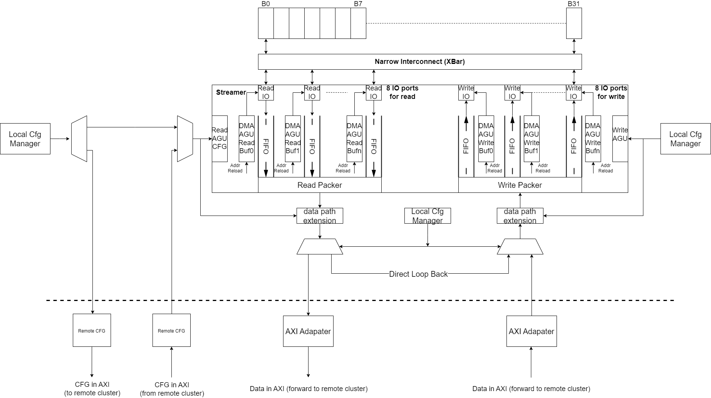
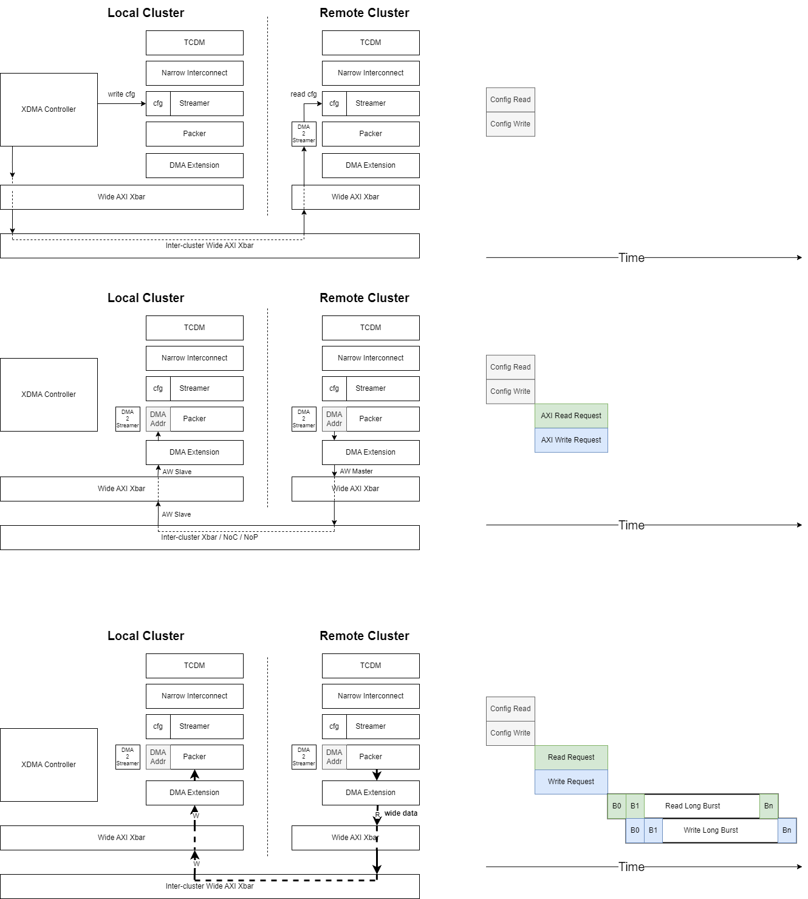

# Snax-Cluster eXtendable Distributed Memory Access (XDMA)

This folder contains all the source code of the eXtendable Distributed Memory Access, which will be used widely inside snax clusters for intra-cluster / inter-cluster *Computation on Copy (CoC)*. The introduction of XDMA include these aspects:  

- [Snax-Cluster eXtendable Distributed Memory Access (XDMA)](#snax-cluster-extendable-distributed-memory-access-xdma)
  - [Introduction and XDMA hardware block diagram](#introduction-and-xdma-hardware-block-diagram)
    - [Data Fetching Unit (Streamer)](#data-fetching-unit-streamer)
    - [Datapath Extension](#datapath-extension)
    - [Automatic Local Loopback](#automatic-local-loopback)
    - [Distributed DMA (Development is not finished)](#distributed-dma-development-is-not-finished)

## Introduction and XDMA hardware block diagram

The XDMA will be deployed inside every cluster, with the architecture as below: 

### Data Fetching Unit (Streamer)

At the top of the figure, the TCDM interconnect offers the the full-region data access with one-cycle delay if there is no contention. XDMA is configurable in the bit width of both memory channel and AXI channel. The number of data streamers at reader side and writer side will be automatically determined by dividing them. Take the following conditions as examples: 

- Define *TCDMDataWidth=64* and *AXIDataWidth=512*: This is the normal condition for snax cluster. XDMA will then instantiate eight different channels for both read and write at TCDM side, and concatenate them as one 512-bit channel at AXI side. 
- Define *TCDMDataWidth=64* and *AXIDataWidth=64*: This is the condition for global scratchpad memory / SRAM. XDMA will then only instantiate one channel for both side, downgrading to a more simpler architecture which most other DMAs use. 

Each TCDM channel is provided with private address caches and data caches, so that it can fetch the data independently with minimal influence from other channels. All read channels or write channels share one multi-channel AGU to enable the parallel n-dimensional strided fetch, with the granularity of *TCDMDataWidth*. 

Arbitary number of TCDM channels can be turned off for the conditition that the last data is not integer times of bus width. The turned off channels will not fetch the data from the memory, and pad its output with 0. This can save energy by avoiding unnecessary transmission, and it also providing the easy way to do memory initialization by turning off all reader channels and turning on all the writer channels. By this way, the padded zero is written into the memory. 

Apart from the memory channels that can be turned off as user's intention, the byte mask is also implemented here for the byte-level granularity writing purpose. 

Near the output of streamer, the data is concatenated to a wide bus, forwarding to datapath extension. 

### Datapath Extension

Datapath Extension is the very important building block. It enables any on-the-fly data processing: matrix transpose, max-pooling, average-pooling, datastream compression / decompression etc. By providing the XDMA generator the necessary parameters, the extension modules will be instantiated one by one, with the output of one extension forwarded to the input of another extension. 

Design the custom datapath extension is extremely easy. Thanks to Chisel's agility, it automatically do many thing for you: The pipeline is automatically inserted, the CSR configs are automatically wired to the inside of the extension, the infrastructures for enabling / disabling the extension is automatically added, even the corresponding C header for runtime is automatically generated... Both native extension written in Chisel and extension written in SystemVerilog can be integrated insanely easy, and you don't need to be panic at all. 

### Automatic Local Loopback

In case the source address and destination address come from the same memory region, the data does not need to go on AXI and waste energy. The logic inside the controller of XDMA automatically discover it and trigger the automatic loopback, directly forward the data from reader path to writer path. 

### Distributed DMA (Development is not finished)

In case the source address and destination address come from the different memory region, the XDMA use another half from remote to accomplish the data copy. There are three steps: First, the controller discover the source data is not coming from the local memory region, so the configutation is flattened into one dimensional frame. Second, the configuration frame is forwarded to the remote XDMA to request the data. Third, the data is forwarded from the remote back to local. 

